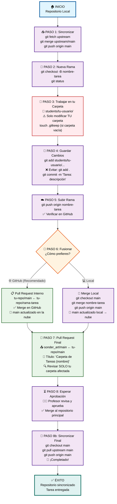

# Diagrama de Flujo: Entrega de Tareas en GitHub

> **🎯 Visualización completa del proceso** - Sigue el flujo paso a paso para una entrega exitosa

## 📊 Flujo Visual Completo



---

## 🎨 Código de Colores del Diagrama

| Color | Significado | Elementos |
|-------|-------------|-----------|
| 🔵 **Azul** | Inicio y Final | Puntos de entrada y salida |
| 🟣 **Morado** | Procesos Normales | Pasos regulares del flujo |
| 🟠 **Naranja** | Decisiones | Puntos donde eliges una opción |
| 🟢 **Verde** | Acciones en GitHub | Interacciones con la plataforma |
| 🔴 **Rojo** | Advertencias | Pasos críticos que requieren atención |
| 🟢 **Verde Oscuro** | Éxito | Completación exitosa |

---

## 📋 Información Clave por Paso

### 🔄 **Flujo Principal vs Alternativo**

| Aspecto | 🌐 **GitHub (Recomendado)** | 💻 **Local** |
|---------|---------------------------|---------------|
| **Dificultad** | ⭐⭐ Fácil | ⭐⭐⭐ Intermedio |
| **Visibilidad** | ✅ Clara en interfaz web | ❌ Solo en terminal |
| **Reversibilidad** | ✅ Fácil de deshacer | ⚠️ Requiere más comandos |
| **Aprendizaje** | 📚 Enseña GitHub UI | 🔧 Enseña Git puro |

### ⚠️ **Puntos Críticos de Atención**

#### 🎯 **Paso 3: Zona de Trabajo**
- **✅ Correcto:** `students/tu-usuario/mi-tarea/`
- **❌ Incorrecto:** Cualquier carpeta fuera de tu usuario
- **💡 Tip:** Usa `pwd` para verificar tu ubicación

#### 🎯 **Paso 4: Staging de Archivos**
- **✅ Correcto:** `git add students/tu-usuario/archivo.txt`
- **❌ Peligroso:** `git add .` (puede incluir archivos no deseados)
- **💡 Tip:** Usa `git status` antes de cada commit

#### 🎯 **Paso 7: Pull Request Final**
- **✅ Dirección correcta:** `sonder_art/main ← tu-repo/main`
- **❌ Dirección incorrecta:** `tu-repo/main ← sonder_art/main`
- **💡 Tip:** Revisa la dirección antes de crear el PR

---

## 🚀 Comandos Rápidos por Paso

### **Secuencia Completa Resumida**
```bash
# Paso 1: Sincronizar
git checkout main
git fetch upstream
git merge upstream/main
git push origin main

# Paso 2: Nueva rama
git checkout -b mi-tarea-nueva

# Paso 3-4: Trabajar y guardar
cd students/mi-usuario
# ... hacer cambios ...
git add students/mi-usuario/
git commit -m "Tarea: descripción clara"

# Paso 5: Subir
git push origin mi-tarea-nueva

# Paso 6: Fusionar (opción GitHub recomendada)
# → Ir a GitHub y crear PR interno

# Paso 7: PR final
# → Crear PR desde tu main al main del profesor

# Paso 8: Sincronizar final (después de aprobación)
git checkout main
git pull upstream main
git push origin main
```

---

## 💡 Tips de UX para el Flujo

### 🎯 **Antes de Empezar**
- [ ] Verifica que tienes configurado `upstream`
- [ ] Confirma tu identidad Git: `git config --list`
- [ ] Asegúrate de estar en la carpeta correcta: `pwd`

### 🎯 **Durante el Proceso**
- [ ] Usa `git status` frecuentemente
- [ ] Verifica cada comando antes de ejecutarlo
- [ ] Lee los mensajes de Git cuidadosamente

### 🎯 **Al Final**
- [ ] Revisa el PR antes de enviarlo
- [ ] Confirma que solo tu carpeta está afectada
- [ ] Espera confirmación del profesor antes de continuar

---

## 🔗 Enlaces Relacionados

- 📖 **[Flujo Detallado](01_flujo_git.md)** - Instrucciones paso a paso completas
- 📚 **[Cheatsheet](02_cheatsheet_git_github.md)** - Comandos básicos y referencia rápida
- 🌐 **GitHub Docs** - Documentación oficial de GitHub
- 📺 **Git Tutorials** - Videos tutoriales recomendados
