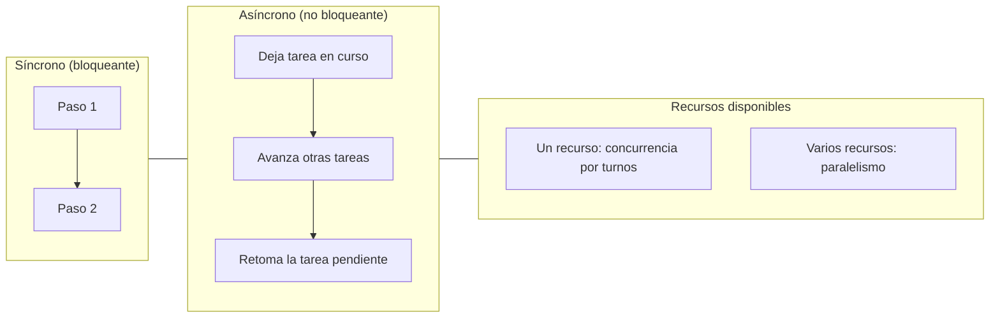

## Síncrono vs Asíncrono (guía para principiantes, con ejemplos y diagramas)

Este documento parte de que ya viste la guía de hilos y procesos. Aquí nos enfocamos en entender, con calma y desde cero, qué significa trabajar de forma síncrona o asíncrona, cómo se relaciona con concurrencia y paralelismo, y cómo encaja con hilos, procesos y sistemas distribuidos. Usaremos metáforas, ejemplos cotidianos y diagramas sencillos.


### Mapa de lectura
- Ideas base antes de empezar
- Definiciones claras (síncrono, asíncrono, bloqueante, no bloqueante)
- Concurrencia, paralelismo y distribuido: qué son y cómo se relacionan
- Metáforas y ejemplos cotidianos
- Diagramas ASCII y Mermaid
- Tabla de conceptos (para no confundirlos)
- Relaciones y combinaciones posibles (quién implica a quién)
- ¿Cuándo conviene cada enfoque?
- Conexión con hilos/procesos (resumen)


### Ideas base antes de empezar
- Tarea: cualquier trabajo a realizar (p. ej., leer un archivo, hacer una petición de red, cocinar un plato).
- Espera: intervalos en los que una tarea no puede avanzar (p. ej., esperar a disco/red/horno).
- Recurso: lo que permite ejecutar tareas (tiempo de CPU, núcleos, memoria, dispositivos, máquinas).
- Hilo: un “trabajador” dentro de un proceso (misma memoria).
- Proceso: una “casa” con memoria propia (aislada); para hablar con otras casas se usa comunicación explícita.


### Definiciones claras
- Síncrono (simple): haces una cosa después de la otra. Si algo tarda, esperas a que termine y luego sigues.
  - (técnica) La ejecución se detiene en una operación hasta obtener su resultado (bloquea).
  - Ejemplo cotidiano: preparar un sándwich y, solo cuando terminas, preparar un café.
  - Ejemplo de cómputo: leer un archivo, luego procesarlo, luego guardar; cada paso inicia cuando el anterior termina.

- Asíncrono (simple): dejas una tarea “en curso” y continúas con otra mientras esperas el resultado de la primera.
  - (técnica) Cuando una tarea está esperando (p. ej., E/S), otras tareas pueden avanzar.
  - Ejemplo cotidiano: pedir comida a domicilio y, mientras llega, limpiar la mesa; cuando timbran, atiendes la entrega.
  - Ejemplo de cómputo: iniciar varias descargas y, mientras unas esperan, validar/preparar otros datos en memoria.

- Bloqueante vs no bloqueante:
  - Bloqueante: la llamada detiene a quien la hace hasta terminar (te quedas esperando).
  - No bloqueante: la llamada devuelve rápido y podrás retomar/continuar cuando haya resultado.


### Concurrencia, paralelismo y distribuido
- Concurrencia (simple): varias tareas progresan durante el mismo periodo de tiempo. No implica que ocurran exactamente al mismo instante físico.
  - (técnica) Puede lograrse alternando la atención entre tareas en un único recurso o usando varios hilos/procesos.
  - Ejemplo cotidiano: mientras el horno hornea (espera), cortas verduras; ambas tareas progresan en el mismo periodo.

- Paralelismo (simple): dos o más tareas se ejecutan exactamente al mismo tiempo porque hay más de un recurso de cómputo (núcleos, dispositivos).
  - (técnica) Requiere ejecutar múltiples hilos o procesos simultáneamente en núcleos distintos.
  - Ejemplo cotidiano: dos personas cocinan platos diferentes al mismo tiempo en cocinas separadas.

- Distribuido (simple): el trabajo se reparte entre varias máquinas conectadas por red.
  - (técnica) Añade comunicación de red, latencia y fallos parciales; puede ser concurrente y paralelo.

Notas importantes:
- Asíncrono es un estilo de ejecución; suele producir concurrencia, pero por sí solo no garantiza paralelismo de CPU.
- Paralelismo es un caso particular de concurrencia: si dos tareas corren al mismo tiempo, también progresan en el mismo periodo.


### Metáforas y ejemplos cotidianos
- Síncrono: “una ventanilla, una persona”. Haces fila y esperas a que terminen contigo antes de pasar a lo siguiente.
- Asíncrono: “pides turno y te avisan”. Pides algo, sigues con otras cosas, y cuando te toca, retomas.
- Concurrente: “varias cosas avanzan durante el mismo periodo”. Horno funcionando mientras cortas verduras.
- Paralelo: “varias personas trabajando a la vez”. Dos cocineros cocinando platos distintos exactamente al mismo tiempo.
- Distribuido: “varias casas cocinan y luego juntan los platos”. Reparto de trabajo entre lugares distintos conectados.


### Diagramas ASCII

Síncrono (esperas detienen el avance general):
```
Tiempo →  |---- Tarea A ----(espera)---- continúa A ----|---- Tarea B ----|
             ^ nadie más avanza mientras A espera
```

Asíncrono (mientras A espera, otras tareas avanzan):
```
Tiempo →  |-- A inicia --(espera)-->         <-- retoma A --|
          |-- B avanza durante la espera de A --|
          |-- C avanza durante la espera de A -----------|
```

Concurrencia con varios “trabajadores” (p. ej., hilos) en E/S:
```
Trabajador 1: |-- A --(espera E/S)------ retoma A --|
Trabajador 2:          |-- B --(espera E/S)---- retoma B --|
Trabajador 3:                   |-- C --(espera E/S)- retoma C --|
```

Paralelismo (dos recursos ejecutando al mismo tiempo):
```
CPU 1: |==== Trabajo X ====|
CPU 2: |==== Trabajo Y ====|  (X e Y realmente ocurren al mismo tiempo)
```


### Diagrama Mermaid (visión general segura)



### Tabla de conceptos (para no confundirlos)

| Concepto      | Qué describe               | ¿Requiere varios núcleos? | Idea clave                                                |
|---------------|----------------------------|---------------------------|-----------------------------------------------------------|
| Síncrono      | Estilo de ejecución        | No                        | Esperas hasta terminar cada paso                          |
| Asíncrono     | Estilo de ejecución        | No                        | Puedes seguir avanzando mientras algo tarda               |
| Concurrencia  | Progreso en el tiempo      | No                        | Varias tareas progresan durante el mismo periodo          |
| Paralelismo   | Uso simultáneo de hardware | Sí                        | Varias tareas corren exactamente al mismo tiempo          |
| Hilos         | Unidad de ejecución        | No (por sí mismo)         | Varios “trabajadores” en la misma memoria                 |
| Procesos      | Aislamiento de recursos    | No (por sí mismo)         | “Casas” separadas; coordinación explícita entre ellas     |
| Distribuido   | Múltiples máquinas         | No (por sí mismo)         | Trabajo en red; coordinación y tolerancia a fallos        |
| Bloqueante    | Semántica de llamada       | No                        | El ejecutor queda detenido hasta que termine              |
| No bloqueante | Semántica de llamada       | No                        | La llamada devuelve y podrás continuar/retomar después    |


### Relaciones y combinaciones (quién implica a quién)
- ¿Concurrente sin asíncrono? Sí. Varias personas trabajando en tareas distintas durante el mismo periodo.
- ¿Asíncrono sin concurrencia efectiva? Posible. Si dejas una tarea “en curso” pero no avanzas en ninguna otra, no obtienes beneficio.
- ¿Paralelo sin concurrencia? No. Si dos tareas corren al mismo tiempo, también progresan en el mismo periodo.
- ¿Paralelo sin “estilo asíncrono”? Sí. Dos procesos que ejecutan pasos secuenciales, pero en núcleos distintos.
- ¿Distribuido sin paralelismo? Sí. Varias máquinas procesando de forma secuencial cada una.
- ¿Distribuido y paralelo? Sí. Varias máquinas y varios núcleos trabajando al mismo tiempo.

Tabla de combinaciones (sí/no) y notas:

| Combinación                               | ¿Posible? | Nota                                                                 |
|------------------------------------------:|:---------:|----------------------------------------------------------------------|
| Asíncrono sin concurrencia                |    Sí     | Dejas una tarea pendiente pero no avanzas en otras                   |
| Concurrente sin asíncrono                 |    Sí     | Varias personas/hilos/procesos progresando en el mismo periodo       |
| Paralelo sin concurrencia                 |    No     | Paralelo implica concurrente                                         |
| Paralelo sin “estilo asíncrono”           |    Sí     | Procesos con pasos secuenciales en núcleos distintos                 |
| Distribuido sin paralelismo               |    Sí     | Varias máquinas con trabajo secuencial interno                       |
| Distribuido y paralelo                    |    Sí     | Varias máquinas y núcleos trabajando al mismo tiempo                 |
| “Concurrencia implica paralelismo”        |    No     | Puede existir solo progreso alternado en un único recurso            |
| “Paralelismo implica concurrencia”        |    Sí     | Si corren a la vez, progresan en el mismo periodo                    |


### ¿Cuándo conviene cada enfoque?
- Usa estilo síncrono cuando:
  - El flujo es simple y la carga es baja.
  - La claridad del código es prioritaria y el rendimiento actual es suficiente.
- Usa estilo asíncrono cuando (especialmente E/S):
  - Muchas operaciones dependen de esperas externas (red, disco, BD) y quieres que otras tareas sigan avanzando mientras esperas.
  - Buscas alta capacidad para manejar muchas tareas con esperas.
- Usa paralelismo (varios recursos) cuando (trabajo de CPU):
  - Quieres ejecutar cómputo al mismo tiempo en múltiples núcleos o dispositivos.
  - Aceptas el coste de coordinación entre “trabajadores” (hilos/procesos/máquinas).
- Usa distribuido cuando:
  - Necesitas escalar más allá de una sola máquina.
  - Aceptas la complejidad de red, fallos parciales y coordinación remota.


### Conexión con hilos y procesos (resumen)
- Hilos: varios “trabajadores” dentro de la misma “casa” (proceso), comparten memoria. Muy útiles para concurrencia en escenarios con esperas.
- Procesos: “casas” separadas con su memoria; ideales para paralelismo verdadero de CPU y aislamiento, a costa de coordinación explícita.
- Distribuido: varias “casas” en distintas ubicaciones (máquinas) coordinándose por red.

Más adelante, en notebooks, veremos implementaciones prácticas y cómo usar herramientas de Python para modelar estos enfoques sin perder las ideas fundamentales.


### Apéndice práctico: librerías estándar de Python para estos conceptos

A continuación introducimos herramientas de la biblioteca estándar. Usaremos ejemplos simples (incluso “tontos”) para ver claramente qué ocurre.

- time: utilidades de tiempo (p. ej., sleep para simular esperas).
- threading: crear hilos (varios “trabajadores” en la misma memoria).
- concurrent.futures:
  - ThreadPoolExecutor: grupo de hilos para ejecutar funciones concurrentemente (útil en esperas de E/S).
  - ProcessPoolExecutor: grupo de procesos para ejecutar funciones en paralelo real (útil en trabajo de CPU).
- asyncio: estilo asíncrono en un solo hilo con corrutinas y await (útil para mucha E/S no bloqueante).


#### 1) Síncrono básico (bloqueante)
Descripción: ejecutamos 5 tareas que “duermen” 0.5s. Como es bloqueante, van una después de la otra.

```python
import time

def tarea_bloqueante(i):
    # Simula esperar E/S o una operación que tarda
    time.sleep(0.5)
    return f"ok {i}"

def main():
    resultados = []
    for i in range(5):
        # Hasta que no termina la tarea i, no empezamos la siguiente
        resultados.append(tarea_bloqueante(i))
    print(resultados)

if __name__ == "__main__":
    main()
```


#### 2) Concurrente con hilos (sin asíncrono) para E/S simulada
Descripción: mismas 5 tareas, pero cada una puede “esperar” mientras otras avanzan, usando hilos.

```python
from concurrent.futures import ThreadPoolExecutor, as_completed
import time

def tarea_io(i):
    # Simula E/S o espera de red
    time.sleep(0.5)
    return f"ok {i}"

def main():
    with ThreadPoolExecutor(max_workers=5) as ex:
        futuros = [ex.submit(tarea_io, i) for i in range(5)]
        # Opción 1: esperar todas en bloque
        print([f.result() for f in futuros])
        # Opción 2: procesar resultados conforme terminan
        # for f in as_completed(futuros):
        #     print(f.result())

if __name__ == "__main__":
    main()
```

Comandos relevantes:
- ThreadPoolExecutor(max_workers=N): crea un grupo con N hilos.
- submit(func, arg): envía una tarea (devuelve un Future).
- as_completed(futuros): itera en el orden en que van terminando.


#### 3) Asíncrono (asyncio) orientado a E/S no bloqueante
Descripción: cooperativamente, varias tareas “ceden” el control durante la espera y otras progresan.

```python
import asyncio

async def tarea_io(i):
    # Simula E/S no bloqueante: cede el control por 0.5s
    await asyncio.sleep(0.5)
    return f"ok {i}"

async def main():
    # Creamos varias tareas; el event loop las gestionará
    tareas = [asyncio.create_task(tarea_io(i)) for i in range(5)]
    resultados = await asyncio.gather(*tareas)
    print(resultados)

if __name__ == "__main__":
    asyncio.run(main())
```

Comandos relevantes:
- asyncio.run(coro): ejecuta una corrutina principal.
- async def / await: define y espera corrutinas (puntos donde se “cede” el control).
- create_task / gather: lanzar varias tareas y esperar sus resultados.


#### 4) Paralelismo real (procesos) para CPU
Descripción: ejecuta cómputo intenso en varios procesos, aprovechando múltiples núcleos.

```python
from concurrent.futures import ProcessPoolExecutor

def cpu_intensivo(n):
    # Trabajo CPU-bound (bucle grande)
    s = 0
    for i in range(n):
        s += (i * i) % 97
    return s

def main():
    datos = [2_000_00] * 4  # cuatro trabajos similares
    with ProcessPoolExecutor() as ex:
        # map distribuye el trabajo entre procesos
        resultados = list(ex.map(cpu_intensivo, datos))
    print(resultados)

if __name__ == "__main__":
    main()
```

Comandos relevantes:
- ProcessPoolExecutor(max_workers=N): crea un grupo de procesos.
- map/submit: reparte tareas entre procesos (requiere serializar argumentos y resultados).


### Casos edge (con ejemplos claros)
Los siguientes mini-ejemplos conectan con las combinaciones discutidas en “Relaciones y combinaciones”.

1) Asíncrono sin concurrencia efectiva
Descripción: usamos asyncio pero de forma secuencial; no generamos progreso simultáneo entre tareas.

```python
import asyncio

async def tarea_lenta(i):
    await asyncio.sleep(0.3)
    return i

async def main():
    # Ejecutamos de uno en uno; no hay progreso de varias tareas en el mismo periodo
    r1 = await tarea_lenta(1)
    r2 = await tarea_lenta(2)
    r3 = await tarea_lenta(3)
    print([r1, r2, r3])

if __name__ == "__main__":
    asyncio.run(main())
```

2) Concurrente sin asíncrono (hilos con E/S)
Descripción: el estilo interno de cada tarea es “normal” (bloqueante), pero el sistema ejecuta varias durante el mismo periodo usando hilos.

```python
from concurrent.futures import ThreadPoolExecutor
import time

def descarga(i):
    time.sleep(0.3)  # bloqueante, pero en otro hilo
    return f"archivo {i}"

def main():
    with ThreadPoolExecutor(max_workers=3) as ex:
        print(list(ex.map(descarga, range(5))))

if __name__ == "__main__":
    main()
```

3) Paralelo sin “estilo asíncrono” (procesos con funciones normales)
Descripción: el código de cada tarea es secuencial, pero corren exactamente al mismo tiempo en distintos núcleos.

```python
from concurrent.futures import ProcessPoolExecutor

def tarea_normal(x):
    # función síncrona normal
    total = 0
    for i in range(300_000):
        total += (x + i) % 101
    return total

def main():
    with ProcessPoolExecutor() as ex:
        resultados = list(ex.map(tarea_normal, range(4)))
    print(resultados)

if __name__ == "__main__":
    main()
```

4) Demostración de límite: “paralelo sin concurrencia” (imposible)
Descripción: si dos tareas corren exactamente al mismo tiempo, por definición también progresan en el mismo periodo (o sea, son concurrentes). No hay código que muestre lo contrario; el concepto es contradictorio.

5) Opcional: mezclar estilos (asíncrono + hilos o procesos)
Descripción: a veces quieres muchas conexiones simultáneas (asíncrono) y, para un trabajo puntual de CPU, usar procesos.

```python
import asyncio
from concurrent.futures import ProcessPoolExecutor

def cpu_puntual(x):
    # Simula algo de CPU más pesado
    s = 0
    for i in range(500_000):
        s += (x * i) % 97
    return s

async def simulacion_io(i):
    # Simula I/O no bloqueante
    await asyncio.sleep(0.2)
    return i

async def main():
    # Muchas tareas de E/S
    tareas = [asyncio.create_task(simulacion_io(i)) for i in range(6)]
    # Y de forma puntual, un cálculo de CPU en procesos
    loop = asyncio.get_running_loop()
    with ProcessPoolExecutor() as ex:
        cpu_result = await loop.run_in_executor(ex, cpu_puntual, 7)
    io_result = await asyncio.gather(*tareas)
    print(cpu_result, io_result)

if __name__ == "__main__":
    asyncio.run(main())
```


### Resumen práctico
- Usa ThreadPoolExecutor para concurrencia sencilla en tareas con esperas (E/S) con APIs bloqueantes.
- Usa asyncio para alta concurrencia de E/S sin crear muchos hilos (requiere usar `async`/`await`).
- Usa ProcessPoolExecutor para paralelismo real en CPU.
- Mezcla estilos cuando convenga (muchas esperas + picos de CPU), con moderación.

