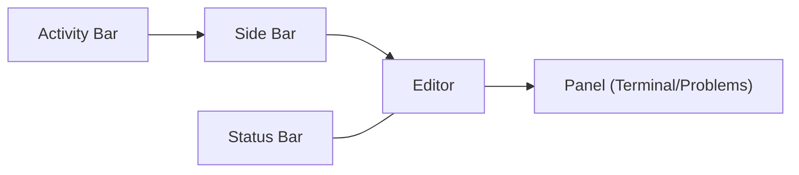
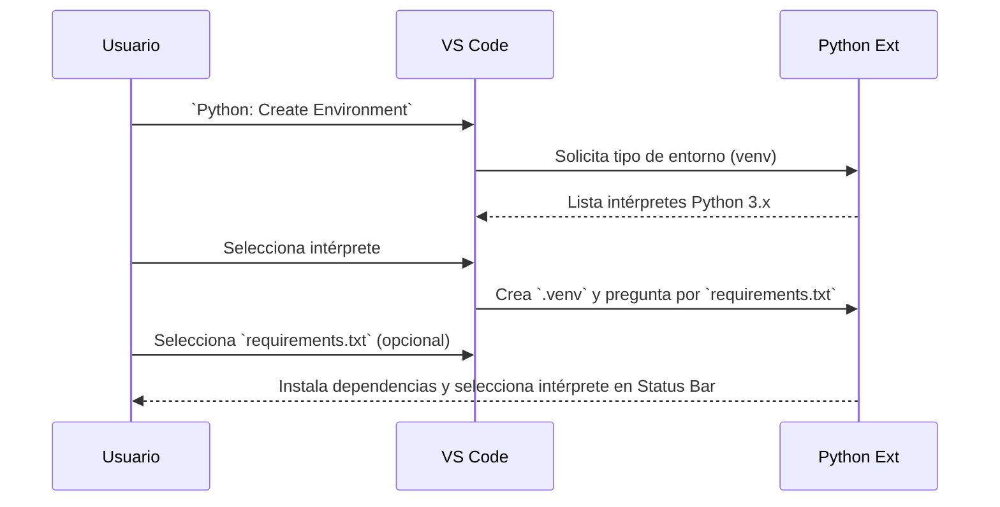
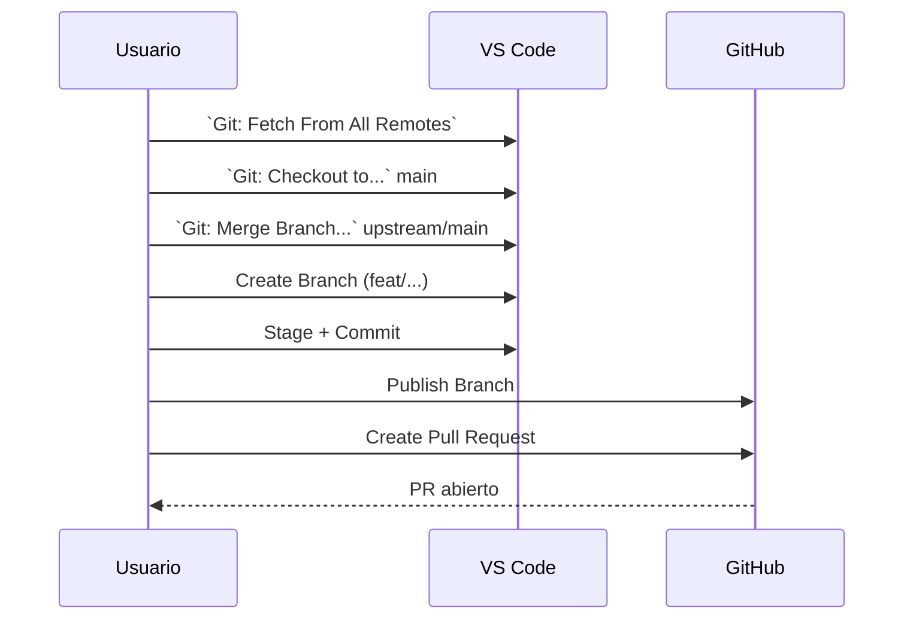

## VS Code — Guía de inicio y configuración para el curso

Esta guía te introduce a Visual Studio Code (VS Code) desde cero, asumiendo que ya lo tienes instalado pero nunca lo has configurado. Está pensada para quien viene de terminal y Python básico.

Al final, entregarás un Pull Request con una bitácora en `students/{tu_carpeta}/vscode/` usando la extensión de GitHub en VS Code.

**Cómo usar esta guía (muy importante)**
- **Tres vías por acción**: Menú → Paleta de Comandos → Atajo. Si un atajo no funciona, usa la Paleta o el Menú.
- **Paleta de Comandos**: `Ctrl+Shift+P` → escribe el nombre del comando (ej. `View: Toggle Terminal`).
- **Atajos actuales**: `Ctrl+K Ctrl+S` (abre `Keyboard Shortcuts`).
- **Reset de layout**: Paleta `Ctrl+Shift+P` → `View: Reset Workbench Layout`.

Tabla de referencia de formatos usados en esta guía

| Tipo | Cómo lo verás | Ejemplo |
|---|---|---|
| Comando de Paleta | `Nombre: Subcomando` | `View: Toggle Terminal` |
| Atajo de teclado | `Ctrl+Tecla` (o `Ctrl+K Ctrl+S`) | `Ctrl+Shift+P` |
| Ruta de menú | `Menú → Submenú` | `View → Explorer` |
| Archivo/Carpeta | `ruta/o/archivo` | `students/{tu_carpeta}/vscode/` |

---

### 0) Markdown primero: cómo leer y previsualizar esta guía

- Abre este archivo en el Editor.
- Previsualiza Markdown: Menú View → "Open Preview to the Side" o Paleta `Ctrl+Shift+P` → "Markdown: Open Preview to the Side".
- Extensiones útiles: "Markdown All in One" (atajos/tablas), "markdownlint" (estilo), "Markdown Preview Mermaid Support" si usarás diagramas.
- Tambien ctrl + shift + v funciona para ver view (en linux), busca el equivalente en tu computadora con chatgpt de ser necesario
Tip: usa la vista previa en paralelo para seguir los pasos mientras configuras VS Code.

---

### 1) ¿Qué es VS Code? (definición y GUI)

- VS Code es un editor de código fuente moderno (IDE ligero) con interfaz gráfica, extensible mediante extensiones (marketplace), con terminal integrada y soporte para cientos de lenguajes.
- Filosofía: rápido, minimal por defecto, extensible por necesidad.

Breve historia:
- Lanzado por Microsoft en 2015, multiplataforma (Linux/WSL2, macOS, Windows), open-source en gran parte (repositorio `microsoft/vscode`).
- Creció gracias al marketplace de extensiones, integración con Git y excelente soporte para Python/JS.

---

### 2) Layout de VS Code (¿qué es cada cosa?)

- Activity Bar (barra lateral izquierda): accesos a Explorer, Search, Source Control (Git), Run/Debug, Extensions.
- Side Bar (panel lateral): contenido de la vista activa (por ejemplo, Explorer muestra carpetas/archivos).
- Editor (centro): pestañas con tus archivos abiertos.
- Panel (abajo): Terminal integrada, Problems (linter/errores), Output, Debug Console.
- Status Bar (abajo de todo): rama Git, intérprete de Python, codificación, fin de línea, etc.
- Command Palette: `Ctrl+Shift+P` (o `F1`) para ejecutar cualquier comando por nombre.

Cómo mostrar/ocultar cada parte (elige Menú o Paleta; atajos dependen del sistema):
- Explorer: Menú View → Explorer, o `Ctrl+Shift+P` → "View: Show Explorer".
- Terminal: Menú Terminal → New Terminal, o `Ctrl+Shift+P` → "View: Toggle Terminal".
- Problems: Menú View → Problems, o `Ctrl+Shift+P` → "View: Toggle Problems".
- Extensions: Menú View → Extensions, o `Ctrl+Shift+P` → "Extensions: View Extensions".
- Restablecer diseño: `Ctrl+Shift+P` → "View: Reset Workbench Layout".

Diagrama del layout (simplificado)



---

Ejercicio guiado (2–3 min):
- Abre VS Code → Paleta `Ctrl+Shift+P` → "View: Toggle Terminal" para abrir/cerrar la terminal integrada. Si tu teclado no tiene backtick fácil, usa el Menú Terminal → New Terminal.
- Abre Explorer (View → Explorer) y Extensions (View → Extensions). Pínchales el icono para entender su función.

Verifica esto:
- Deberías ver la Terminal en el panel inferior, y el icono de Explorer resaltado cuando está activo.
- Si algo se "perdió", ejecuta “View: Reset Workbench Layout”.

---

### 3) Abrir proyecto y estructura de trabajo

Orden recomendado de uso:
1. Abre la carpeta del repo del curso: File → Open Folder → selecciona la carpeta del repositorio local del curso.
2. Explora el `Explorer`: verás `professor/` y `students/`.
3. Trabaja SIEMPRE dentro de `students/{tu_carpeta}/` para tus entregas.

Ejercicio guiado:
- Crea tu carpeta de trabajo para esta guía: `students/{tu_carpeta}/vscode/`.
- Dentro, crea un archivo vacío `bitacora.md` (lo irás llenando durante los pasos de esta guía).

---

### 4) Terminal integrada vs. terminal del sistema

- La terminal integrada de VS Code es “la misma shell” (bash/zsh) pero embebida en la ventana de VS Code. Respeta el directorio abierto en el Explorer por defecto.
- Beneficios: atajos, tareas integradas, contexto del proyecto, selección de intérprete/venv visible en la Status Bar.
- Diferencias prácticas: si cambias de proyecto/carpeta en VS Code, tu terminal integrada ya “está ahí”; evita abrir múltiples terminales externas.

Ejercicio guiado:
- Abre la terminal integrada (Terminal → New Terminal, o Paleta "View: Toggle Terminal"). Ejecuta `pwd`, `which python`, `git status` y confirma que estás en el repo correcto.

Verifica esto:
- La ruta de `pwd` debe corresponder a la carpeta que abriste en VS Code.
- `which python` debe mostrar el Python del sistema si aún no seleccionas `.venv`.

---

### 5) Post-instalación general (UX y temas)

Objetivo: personalizar apariencia y usabilidad antes de programar.

Extensiones de apariencia (elige alguna):
- “One Dark Pro”, “Dracula Official”, “GitHub Theme”, “Tokyo Night”.

Cómo instalar desde la UI:
- Abre la vista Extensions (icono cuadritos en la Activity Bar) → busca el nombre → Install.

Ejercicio guiado (5 min):
1. Instala un theme y aplícalo (View → Extensions → busca "Theme" → Install → "Set Color Theme").
2. Activa Settings Sync si quieres sincronizar en varios equipos: Paleta `Ctrl+Shift+P` → “Settings Sync: Turn On”.
3. Cambia fuente/tamaño y márgenes:

Settings UI: `Ctrl+,` → busca “Font Size”, “Font Family”, “Tab Size”.

O abre settings.json para control fino:

```json
{
  "editor.fontSize": 15,
  "editor.fontFamily": "Fira Code, JetBrains Mono, Consolas, 'Courier New', monospace",
  "editor.fontLigatures": true,
  "editor.tabSize": 4,
  "editor.insertSpaces": true,
  "editor.rulers": [88, 120]
}
```

Verifica esto:
- La Status Bar debe reflejar el tema (colores cambiados) y el tamaño de fuente en el editor debe cambiar al guardar.

---

### 6) Post-instalación para Python

Instala estas extensiones (mínimo):
- “Python” (ms-python.python)
- “Pylance” (ms-python.vscode-pylance)
- “Jupyter” (opcional)
- “Black Formatter” o “Ruff” (opcional)

Selecciona el intérprete/entorno (¿qué es?): el intérprete es el binario de Python que VS Code usará para ejecutar/analizar tu código. Debe apuntar a tu `.venv` del proyecto.
- Paleta `Ctrl+Shift+P` → “Python: Select Interpreter” → elige tu `.venv` del proyecto.
  - “Use Existing Environment”: selecciona un `.venv` ya creado en tu carpeta.
  - “Create New Venv”: crea uno nuevo si no existe o si quieres empezar de cero.
  - ¿Cuándo borrar y crear uno nuevo? Si el entorno quedó roto o las dependencias están en conflicto; elimina la carpeta `.venv/` y vuelve a crear.

Crear entorno desde VS Code (opción gráfica):
- Paleta `Ctrl+Shift+P` → “Python: Create Environment” → `venv` → Python 3.x → VS Code propondrá seleccionar ese intérprete automáticamente.
  - Si tienes `requirements.txt`, VS Code te preguntará si lo usas para instalar deps. Selecciona el archivo y acepta para instalar automáticamente.
  - Si no tienes `requirements.txt`, puedes añadirlo después y usar la acción “Install from Requirements File”.

Diagrama: crear entorno `venv` desde la Paleta



Ejercicio guiado (5–8 min):
1. Crea un `.venv` en la raíz del repo (o del proyecto de ejercicios).
2. Abre un archivo `.py`, verifica que la Status Bar muestra el intérprete seleccionado.
3. Instala `requests` en la terminal integrada y prueba un `import` en el REPL (`python`).

Verifica esto:
- En la Status Bar debe verse el nombre/ruta del `.venv`.
- `import requests` en el REPL no debe dar error.

---

### 7) Configuración de formato, lint y estilo (qué es y cómo habilitarlo)

- Formato (formatter): reescribe tu código para que siga un estilo consistente (espacios, comillas, saltos). Ej.: Black.
- Lint (linter): revisa tu código para detectar problemas de calidad/errores comunes. Ej.: Ruff.
- Análisis de tipos (type checking): te advierte si usas tipos incompatibles. Lo hace Pylance.

Paso a paso (Settings UI):
1. Abre Configuración: `Ctrl+,`.
2. Busca “Default Formatter” y elige “Black Formatter”. Si no aparece, instala la extensión "Black Formatter".
3. Busca “Format On Save” y actívalo (VS Code formateará automáticamente al guardar).
4. Busca “Tab Size” y pon 4. Activa “Insert Spaces” para usar espacios en vez de tabs.
5. Busca “Python › Analysis: Type Checking Mode” y pon “basic”.

Equivalente en settings.json (para copiar/pegar):

```json
{
  "python.formatting.provider": "black",
  "editor.defaultFormatter": "ms-python.black-formatter",
  "editor.formatOnSave": true,
  "ruff.lint.enable": true,
  "python.analysis.typeCheckingMode": "basic"
}
```

Dónde se guarda esto:
- User Settings: aplica a todo tu VS Code (recomendado para preferencias generales).
- Workspace Settings: `.vscode/settings.json` dentro del proyecto (recomendado para reglas del proyecto).

Ejercicio (5–8 min):
- Crea `students/{tu_carpeta}/vscode/hello.py` con una función simple y guarda para ver el autoformato. Abre el panel Problems (View → Problems) para ver avisos del linter.

Verifica esto:
- Al guardar, el código se re-formatea (comillas/espacios). Si no, revisa "Default Formatter" y "Format On Save".
- Problems debe listar advertencias/errores si hay.

---

### 8) Git y GitHub en VS Code (flujo orgánico)

Extensiones:
- “GitHub Pull Requests and Issues” (oficial)
- (Opcional) “GitLens” para historial y blame.

Autentícate con GitHub:
- Abre la vista Source Control → “Sign in to GitHub” o desde la extensión “GitHub Pull Requests and Issues”.

Nota importante: si ya agregaste `upstream` en la terminal, VS Code NO necesita volver a agregarlo. VS Code lee la metadata de Git desde `.git/` en tu carpeta del repo. Puedes verificar remotos actuales con la Paleta: “Git: Open Repository in Command Prompt” o viendo el menú de remotos en Source Control.

Recuerda que nostros ya agregamos el upstream desde la terminal, talvez esto no es necesario.
> Pregunta: 'Si ya lo hicimos desde nuestra terminal, por que no es necesario hacerlo de nuevo desde vscode, como sabe o donde esta la metadata?'
Agrega `upstream`, fetch y merge (desde VS Code). Si no ves una opción, búscala en la Paleta:
1. `Ctrl+Shift+P` → “Git: Add Remote” → nombre: `upstream` → URL del repo del profesor.
2. `Ctrl+Shift+P` → “Git: Fetch From All Remotes”.
3. Cambia a `main`: `Ctrl+Shift+P` → “Git: Checkout to…” → `main`.
4. `Ctrl+Shift+P`

Diagrama: flujo de actualización y PR

