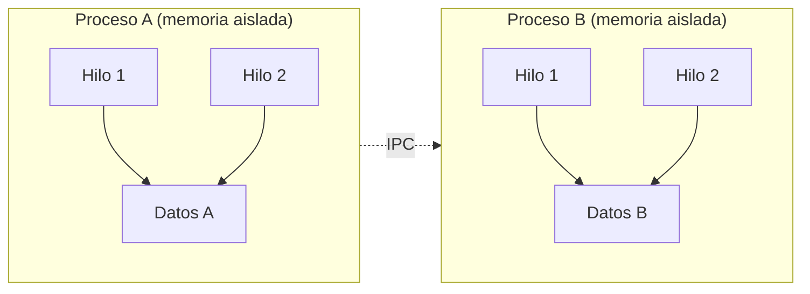

## Hilos vs Procesos (explicación para principiantes, con diagramas)

Este documento introduce de forma clara y gradual qué es un proceso, qué es un hilo, cómo se comparan, cuándo conviene cada uno y por qué en Python existen `ThreadPoolExecutor` y `ProcessPoolExecutor` para trabajar con ambos modelos.


### Metáfora para arrancar
Imagina que tu programa es una casa donde se realiza un proyecto:
- **La casa (proceso)**: tiene su propia dirección, sus muebles y documentos. Está aislada de otras casas.
- **Los habitantes (hilos)**: viven dentro de la misma casa, comparten muebles y documentos, y pueden trabajar en tareas diferentes al mismo tiempo.

Si necesitas más manos dentro de la misma casa compartiendo todo, agregas habitantes (hilos). Si necesitas otra casa con su propio espacio y sin interferencias, creas otra casa (proceso).


### Definición simple y luego un poco más técnica
- **Proceso** (simple): un programa en ejecución con su propio espacio de memoria.
  - (técnica) Es una instancia aislada que el sistema operativo gestiona. Tiene memoria propia, descriptores de archivos, variables de entorno, etc. La comunicación entre procesos requiere mecanismos explícitos (pipes, colas, sockets, etc.).

- **Hilo** (simple): un “trabajador” dentro de un proceso.
  - (técnica) Es una unidad de ejecución ligera que comparte el mismo espacio de memoria del proceso que lo contiene. Varios hilos pueden ejecutar funciones simultáneamente y acceder a los mismos datos (hay que sincronizar para evitar condiciones de carrera).


### Conceptos clave previos: I/O-bound, CPU-bound, GIL e IPC
- **I/O-bound**: tareas cuyo tiempo está dominado por esperas de entrada/salida (peticiones de red, disco, bases de datos). Mejoran con la concurrencia (p. ej., hilos), porque mientras una operación espera, otra puede avanzar.
- **CPU-bound**: tareas cuyo tiempo está dominado por cómputo puro. Mejoran con paralelismo real en varios núcleos (p. ej., procesos).
- **GIL (Global Interpreter Lock, en CPython)**: un cerrojo global por proceso que garantiza que, dentro de un proceso, solo un hilo ejecute bytecode Python a la vez.
  - ¿Por qué existe? Simplifica muchísimo la implementación del intérprete y la gestión de memoria basada en recuento de referencias (reference counting) sin poner candados finos en todas las estructuras internas. También facilita que extensiones en C para CPython sean más sencillas y seguras por defecto. Es un compromiso histórico entre simplicidad y rendimiento multihilo en CPU.
  - ¿Qué hace exactamente? Permite que un único hilo “posea” el intérprete para ejecutar bytecode. El intérprete cambia de hilo periódicamente y muchos bloques que hacen I/O o computación nativa (C) pueden soltar el GIL temporalmente. Cuando un hilo se bloquea en I/O, el GIL se libera y otro hilo puede avanzar.
  - Implicaciones prácticas:
    - Para trabajo **I/O-bound**, los hilos funcionan bien: al esperar I/O se libera el GIL, por lo que otros hilos continúan.
    - Para trabajo **CPU-bound**, varios hilos compiten por el GIL y no obtienen paralelismo real en múltiples núcleos. Para escalar, usa procesos o librerías que ejecutan cómputo nativo liberando el GIL.
  - Alternativas/escapes: usar procesos (multiprocessing / `ProcessPoolExecutor`), usar librerías que suelten el GIL en secciones críticas (NumPy, algunas de OpenCV, lxml), compilar código con Cython liberando el GIL, o usar `asyncio` para alta concurrencia de I/O en un solo hilo (no da paralelismo de CPU). Otros intérpretes (Jython, IronPython) no tienen GIL; PyPy tiene un modelo distinto pero mantiene un bloqueo global. Existen builds recientes “free-threaded” experimentales sin GIL, pero no son el comportamiento por defecto de CPython.
- **IPC (Inter-Process Communication)**: mecanismos para que procesos intercambien datos y coordinen trabajo (pipes, colas, sockets, memoria compartida). Aporta aislamiento y robustez, pero suele requerir **serialización/copias** y un protocolo claro, lo que añade coste.


### Diagrama ASCII (memoria y ejecución)

```
+------------------------------+             +------------------------------+
|        Proceso A             |             |         Proceso B            |
|  Memoria A (aislada)         |             |  Memoria B (aislada)         |
|  +---------+  +---------+    |             |  +---------+  +---------+    |
|  | Hilo 1  |  | Hilo 2  |    |             |  | Hilo 1  |  | Hilo 2  |    |
|  | (comp.) |  | (comp.) |    |             |  | (comp.) |  | (comp.) |    |
|  +---------+  +---------+    |             |  +---------+  +---------+    |
|   (comparten Memoria A)      |             |   (comparten Memoria B)      |
+------------------------------+             +------------------------------+

Leyenda: (comp.) = comparten la memoria del proceso que los contiene.
```


### Diagrama Mermaid (visión de componentes)




### ¿Qué comparten y qué aíslan?
- **Procesos**: aíslan memoria; no comparten variables por defecto. Comunicar datos implica IPC (Inter-Process Communication).
- **Hilos**: comparten memoria y recursos del proceso; acceder a los mismos datos es fácil, pero requiere sincronización para evitar errores.


### Ventajas y desventajas
- **Procesos**
  - Ventajas:
    - **Aislamiento fuerte**: fallas en un proceso no tumban a los demás.
    - **Paralelismo real** en múltiples núcleos, ideal para trabajo intensivo en CPU (en Python, evita el impacto del GIL).
    - Seguridad por separación de memoria.
  - Desventajas:
    - **Comunicación más costosa** (IPC, serialización).
    - **Mayor sobrecarga** al crear y gestionar procesos.
    - Compartir grandes cantidades de datos puede ser ineficiente.

- **Hilos**
  - Ventajas:
    - **Compartición de memoria**: muy conveniente para datos comunes.
    - **Baja sobrecarga** al crearlos en comparación con procesos.
    - Excelentes para tareas **I/O-bound** (esperas de red, disco, etc.).
  - Desventajas:
    - **Riesgo de condiciones de carrera** y bloqueos si no se sincroniza bien.
    - En Python (CPython), el **GIL** limita el paralelismo de CPU puro.
    - Una falla grave en un hilo puede afectar al proceso entero.


### Tabla comparativa

| Aspecto                      | Hilos (threads)                         | Procesos (processes)                         |
|-----------------------------:|-----------------------------------------|----------------------------------------------|
| Memoria                      | Compartida dentro del proceso           | Aislada por proceso                          |
| Comunicación                 | Sencilla (comparten objetos)            | IPC (colas, pipes, sockets, shared memory)   |
| Coste de creación            | Bajo                                    | Más alto                                     |
| Aislamiento de fallos        | Bajo (afecta al proceso)                | Alto (se aísla entre procesos)               |
| Paralelismo CPU en Python    | Limitado por GIL                        | Completo (cada proceso con su GIL)           |
| Mejor caso de uso            | I/O-bound, mucha espera                 | CPU-bound, cálculos intensivos               |
| Compartir grandes datos      | Fácil (mismo espacio)                   | Costoso (copias/serialización)               |


### ¿Cuándo conviene cada uno?
- **Usa hilos** cuando:
  - Las tareas pasan mucho tiempo esperando I/O (peticiones HTTP, lectura/escritura en disco).
  - Quieres compartir fácilmente estructuras en memoria y coordinar el trabajo.
  - Deseas baja latencia y menor sobrecarga en la creación/gestión.

- **Usa procesos** cuando:
  - El trabajo es intensivo en CPU (cálculo numérico, compresión, cifrado, análisis pesado).
  - Necesitas aislamiento por robustez o seguridad.
  - El GIL de Python te impide escalar con hilos para CPU-bound.


### Mirando hacia la práctica: ejecutores de alto nivel en Python
Python ofrece una API sencilla para paralelismo con hilos y procesos a través de `concurrent.futures`:

```python
from concurrent.futures import ThreadPoolExecutor, ProcessPoolExecutor
```

- **ThreadPoolExecutor**: crea un “pool” de hilos para ejecutar tareas I/O-bound de forma concurrente y con baja sobrecarga.
- **ProcessPoolExecutor**: crea un “pool” de procesos para ejecutar tareas CPU-bound en paralelo real (aprovechando múltiples núcleos).

Ejemplos de patrones típicos (idea general, sin entrar en detalles todavía):

```python
# I/O-bound (descargas, llamadas HTTP, lectura de muchos archivos pequeños):
with ThreadPoolExecutor(max_workers=8) as executor:
    futures = [executor.submit(func_io, arg) for arg in lotes_de_trabajo]
    resultados = [f.result() for f in futures]
```

```python
# CPU-bound (cómputo pesado, transformaciones numéricas intensivas):
with ProcessPoolExecutor(max_workers=8) as executor:
    futures = [executor.submit(func_cpu, arg) for arg in lotes_de_trabajo]
    resultados = [f.result() for f in futures]
```

Puntos a tener en cuenta cuando usemos estos ejecutores (que veremos en el notebook más adelante):
- **Serialización (procesos)**:
  - Los datos cruzan límites de proceso, así que normalmente se serializan (p. ej., con `pickle`). Esto implica CPU extra y copias de memoria.
  - Evita pasar objetos muy grandes frecuentemente. Prefiere IDs/rutas/offsets y que cada proceso lea/procese localmente.
  - Asegúrate de que funciones y objetos sean “picklables” (funciones a nivel de módulo, sin cierres complejos). En Windows/macOS (modo “spawn”), protege el punto de entrada con `if __name__ == "__main__":`.
  - Para grandes arreglos numéricos, considera memoria compartida (`multiprocessing.shared_memory`) o formatos de acceso eficiente (mmap, archivos intermedios) para reducir copias.

- **Inmutabilidad/seguridad (hilos)**:
  - El GIL no evita condiciones de carrera en estructuras mutables. Usa mecanismos de sincronización (`threading.Lock`, `RLock`, `Semaphore`, `Condition`) cuando varios hilos escriben los mismos datos.
  - Prefiere pasar datos inmutables (tuplas, strings) o copias por hilo si es barato. Para pipelines, usa colas seguras para hilos (`queue.Queue`) y evita compartir estados globales.
  - Mantén las secciones críticas protegidas por locks lo más cortas posible para minimizar contención y evitar deadlocks.

- **Tamaño del lote y afinado (tuning)**:
  - `max_workers`: para CPU-bound, empieza en `n_cores` (p. ej., `os.cpu_count()`). Para I/O-bound, puedes usar más que núcleos, pero limita para no saturar servicios externos (p. ej., 2–10× núcleos según latencia/throughput de I/O).
  - Tamaño de tarea (granularidad): tareas demasiado pequeñas aumentan la sobrecarga de planificación; tareas enormes reducen el balanceo de carga. Busca un punto medio y mide.
  - Chunking: cuando uses `map`, en procesos puedes ajustar `chunksize` para agrupar elementos y reducir overhead de envío/recepción.

```python
# Ejemplo de chunksize con ProcessPoolExecutor.map
with ProcessPoolExecutor(max_workers=8) as ex:
    for res in ex.map(func_cpu, iterable, chunksize=100):
        manejar(res)
```


### Resumen rápido
- Un **proceso** es una casa con su memoria: aislado, robusto, bueno para CPU-bound.
- Un **hilo** es un habitante en la misma casa: ligero, comparte memoria, ideal para I/O-bound.
- En Python:
  - Usa **ThreadPoolExecutor** para I/O-bound concurrente.
  - Usa **ProcessPoolExecutor** para CPU-bound paralelo.


