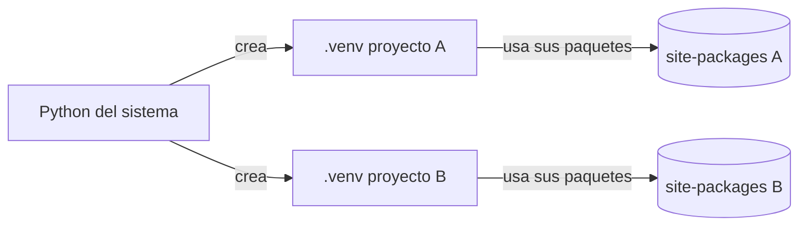
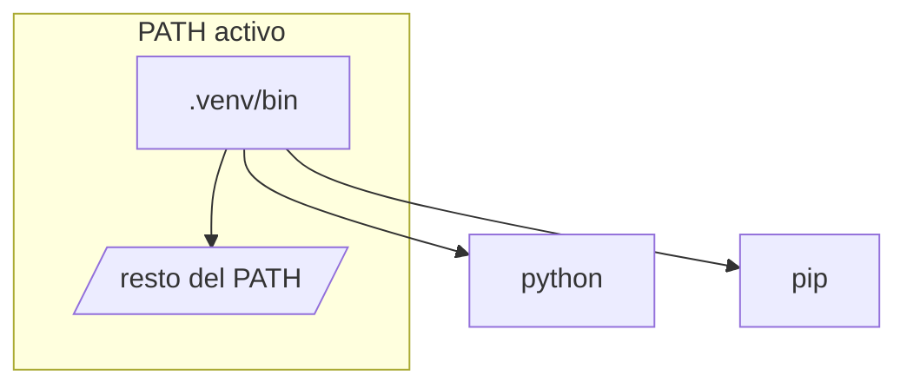
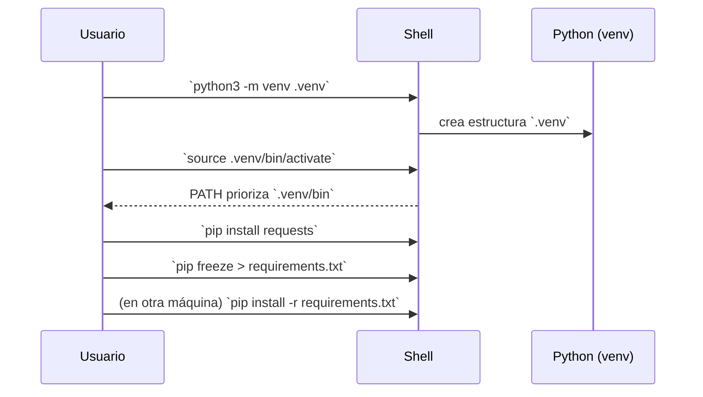
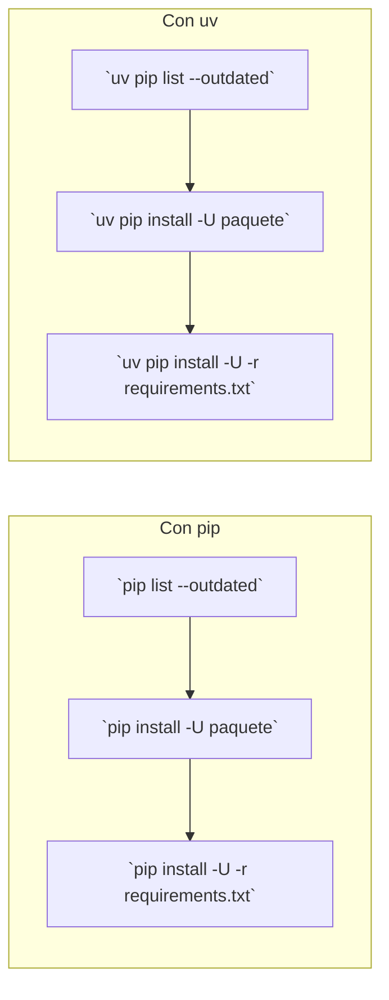

## Ambientes virtuales en Python — Guía práctica para principiantes

Esta guía explica qué son los ambientes virtuales, cómo funcionan, cómo usarlos y los pasos típicos en proyectos reales. Incluye ejemplos de comandos con salidas esperadas, tablas y diagramas.

Importante: al final hay una Tarea Final (Docker + uv + app misteriosa). No incluye soluciones; solo instrucciones claras. Trabaja siempre en tu carpeta de `students/{tu_carpeta}`.

---

### Antes de empezar: flujo de trabajo y entrega (Git y Pull Request)

Trabaja SIEMPRE en tu carpeta de estudiante y entrega por Pull Request.

1) Actualiza tu fork con el upstream

```bash
cd /ruta/a/tu/repo-clase
git fetch upstream
git checkout main
git merge upstream/main
# opcional: git push origin main
```

2) Copia el material del profe a tu carpeta de estudiante

```bash
mkdir -p students/{tu_carpeta}/python_env
cp -r professor/python_env/* students/{tu_carpeta}/python_env/
ls -la students/{tu_carpeta}/python_env
```

Desde ahora, trabaja SOLO en `students/{tu_carpeta}/python_env/`.
No modifiques archivos bajo `professor/`.

3) Al terminar, crea tu rama, confirma y sube

```bash
git checkout -b feat/python-env-mystery
git add students/{tu_carpeta}/python_env
git commit -m "Python env: ejercicios y reto mystery"
git push origin feat/python-env-mystery
```

4) Crea tu Pull Request (PR) una vez completes el ejercicio final de Docker & UV

- Abre tu repo en GitHub y crea un PR desde tu rama hacia el branch indicado en clase.
- Verifica que `students/{tu_carpeta}/python_env/` contiene tus cambios.

---

### ¿Qué es un ambiente virtual?

- Un ambiente virtual es una carpeta que contiene su propio intérprete de Python y sus propias dependencias, aisladas del sistema y de otros proyectos.
- Permite que cada proyecto tenga versiones específicas de librerías sin conflictos.

Diagrama simple de aislamiento:



---

### ¿Cómo funciona internamente (idea general)?

- Al crear un ambiente (p. ej., con `python -m venv .venv`) se copian o vinculan binarios mínimos y se genera `pyvenv.cfg` con la ruta del Python base.
- Al activar, tu `PATH` se reordena para usar primero los binarios de `.venv/bin` (Linux/macOS/WSL2). También suele cambiar el prompt del shell.
- Al instalar con `pip`, las librerías se guardan en `.../.venv/lib/pythonX.Y/site-packages/` y no afectan al sistema.

Diagrama de activación (ruta primero):



---

### PATH: qué es y por qué importa

- `PATH` es una variable de entorno con una lista de directorios separados por `:`. Cuando escribes un comando (por ejemplo `python`), el shell busca el ejecutable de izquierda a derecha en esos directorios y usa el primero que encuentra.
- Al activar un virtualenv, `.venv/bin` se antepone al `PATH`. Por eso, el `python` y el `pip` del ambiente “ganan” sobre los del sistema sin que cambies tus comandos.

Cómo inspeccionarlo y entender qué está activo:

```bash
# Ver PATH tal cual
echo $PATH

# Ver PATH en líneas (útil para leer el orden)
printf '%s\n' ${PATH//:/$'\n'}

# Ver qué binario se usa para un comando
command -v python   # o: which python
command -v pip

# Confirmar desde Python
python -c "import sys; print(sys.executable)"
```

Ejemplo antes y después de activar `.venv`:

```bash
$ command -v python
/usr/bin/python

$ source .venv/bin/activate
(.venv) $ command -v python
/ruta/proyecto/.venv/bin/python
(.venv) $ command -v pip
/ruta/proyecto/.venv/bin/pip
```

Diagrama (orden de búsqueda del shell):


Prioridad: izquierda → derecha (el primero encontrado en `PATH` se usa).

---

#### Ejercicio: PATH y binarios activos

```bash
# Antes de activar .venv
which python
python -V
printf '%s\n' ${PATH//:/$'\n'} | head -n 5

# Activa un entorno y compara
python3 -m venv .venv && source .venv/bin/activate
which python
python -c "import sys; print(sys.executable)"
printf '%s\n' ${PATH//:/$'\n'} | head -n 3
deactivate && rm -rf .venv
```

Resultado esperado (forma): el binario apunta a `.venv/bin/python` cuando está activado y `.venv/bin` aparece primero en `PATH`.

---

### Herramientas populares (panorama)

| Herramienta | Incluida | Gestor | Salida freeze/lock | Comandos básicos (ejemplos) | Cuándo usar |
|---|---|---|---|---|---|
| venv + pip | Sí | pip | `requirements.txt` (con `pip freeze`) | `python3 -m venv .venv` · `source .venv/bin/activate` · `pip install ...` · `pip freeze > requirements.txt` | Lo más simple y estándar para empezar |
| uv | No | uv/pip | `requirements.txt` (con `uv pip freeze`), `uv.lock` (cuando se usa `pyproject`) | `uv venv .venv` · `uv pip install ...` · `uv pip freeze > requirements.txt` · `uv lock && uv sync` | Segundo paso: mismo flujo que pip pero más rápido |
| pip-tools | No | pip | `requirements.txt` (compilado desde `requirements.in`) | `pip-compile` · `pip-sync` | Reproducibilidad fuerte manteniendo pip; separa top-level de resueltas |
| Poetry | No | poetry | `poetry.lock` | `poetry add ...` · `poetry lock` · `poetry install` | Proyectos con `pyproject.toml`, apps/libs, publicación |
| Pipenv | No | pipenv | `Pipfile.lock` | `pipenv install` · `pipenv lock` · `pipenv sync` | Flujo integrado clásico, menos usado hoy |
| Conda | No | conda | `environment.yml` (o conda-lock) | `conda create -n ...` · `conda env export` | Ciencia de datos, binarios no-Python |
| virtualenv | No | pip | `requirements.txt` | `virtualenv .venv` (alternativa a venv) | Similar a venv si `venv` no está disponible |

Sugerencia para empezar: venv + pip; cuando necesites “lock” reproducible, agrega pip-tools; o considera Poetry.

Contexto breve
- `venv` nació en la stdlib (Python 3.3) para reemplazar flujos previos (`virtualenv`) con una solución integrada.
- `pip` se incluye desde Python 3.4+, hoy es el estándar de facto para paquetes.
- `uv` es moderno y muy rápido, compatible con flujos `pip`, y puede crear venvs. Útil cuando la velocidad de instalación/resolución importa.

Tabla rápida de roles (qué hace cada cosa)

| Herramienta | Rol principal | Crea entorno | Instala paquetes | Nota |
|---|---|---|---|---|
| `venv` (stdlib) | Crear/gestionar entornos aislados | Sí (`python -m venv .venv`) | No (necesita `pip`) | Estándar, simple |
| `pip` | Gestor de paquetes | No | Sí (`pip install ...`) | Usa el intérprete activo/seleccionado |
| `uv` | Gestor rápido (pip-compatible) y creador de venv | Sí (`uv venv .venv`) | Sí (`uv pip install ...`) | Usa venvs compatibles con `venv` |

---

### Comprobar/instalar: venv, pip y uv

¿Qué son y cómo asegurarte de tenerlos?

- `venv` (desde Python 3.3): módulo estándar para crear entornos. Viene con Python; se invoca como `python3 -m venv .venv`.
- `pip` (desde Python 3.4+ se incluye con Python): gestor de paquetes. Se invoca como `python3 -m pip ...` o `pip ...`.
- `uv` (proyecto moderno de Astral): instala y resuelve muy rápido, compatible con flujos de `pip`. Puede crear entornos (`uv venv`) y gestionar paquetes (`uv pip`).

Ver si los tienes (WSL2/Ubuntu/macOS):

```bash
python3 -V
python3 -m venv -h | head -n 1
python3 -m pip -V
uv -V || echo "uv no está instalado"
```

Instalar si faltan

- Python + pip (WSL2/Ubuntu):
```bash
sudo apt update && sudo apt install -y python3 python3-pip python3-venv
```

- Python (macOS, Homebrew):
```bash
brew install python
```

- uv (script oficial, Linux/macOS):
```bash
curl -LsSf https://astral.sh/uv/install.sh | sh
# Asegura que $HOME/.local/bin esté en tu PATH
export PATH="$HOME/.local/bin:$PATH"
uv -V
```

Notas
- Prefiere `python3 -m pip` para evitar confundir `pip` de otro Python.
- `uv` no reemplaza a `venv`: puede crear entornos equivalentes y también usarlos.

---

### Cómo saber si el ambiente está activado (Linux/WSL2/macOS)

- Prompt suele mostrar el nombre: `(.venv) user@host$`
- `which python` apunta a la ruta dentro de `.venv`.
- `python -c "import sys; print(sys.executable)"` imprime el binario activo (debe apuntar a `.venv`).
- `pip --version` muestra la ruta del `site-packages` usado (debe estar dentro de `.venv`).

Ejemplo:

```bash
$ which python
/ruta/proyecto/.venv/bin/python

$ python -c "import sys; print(sys.executable)"
/ruta/proyecto/.venv/bin/python
```

---

### Pasos típicos con venv (recomendado para empezar)

1) Crear la carpeta del proyecto y el ambiente

```bash
mkdir mi_proyecto && cd mi_proyecto
python3 -m venv .venv
```

Salida esperada (ejemplo): se crea una carpeta `.venv/` con subdirectorios `bin/`, `lib/`, y archivo `pyvenv.cfg`.

Diagrama: flujo con `venv` + `pip`



2) Activar el ambiente

| SO | Comando |
|---|---|
| Linux/WSL2/macOS (bash/zsh) | `source .venv/bin/activate` |
| Linux (fish) | `source .venv/bin/activate.fish` |

Prompt esperado: `(.venv) ...$`

3) Instalar dependencias con pip (dentro del ambiente)

```bash
(.venv) pip install requests
(.venv) python -c "import requests; print(requests.__version__)"
```

Salida esperada: versión instalada (p. ej., `2.x.x`).

4) Congelar versiones en requirements.txt (ejercicio)

```bash
(.venv) pip freeze > requirements.txt
```

Comprueba el archivo y reconstruye el entorno desde cero en la misma carpeta:

```bash
deactivate
rm -rf .venv
python3 -m venv .venv && source .venv/bin/activate
pip install -r requirements.txt
python -c "print('OK freeze')"
```

5) Recrear el ambiente en otra máquina (ejercicio)

```bash
python3 -m venv .venv
source .venv/bin/activate
pip install -r requirements.txt
```

Verifica versión de un paquete crítico para confirmar que coincidió.

6) Desactivar el ambiente

```bash
deactivate
```

El prompt vuelve a la normalidad y `which python` apunta al Python del sistema.

---

Ejemplos concretos para ejercicios

Usa el `requirements.txt` mínimo provisto en `professor/python_env/requirements.txt` (cópialo a tu carpeta de trabajo) para probar los flujos con `requests` y `rich`.

```bash
# copia para trabajar localmente
cp professor/python_env/requirements.txt .

# con pip
python3 -m venv .venv && source .venv/bin/activate
pip install -r requirements.txt
python -c "import requests, rich; print(requests.__version__)"

# con uv
uv venv .venv && source .venv/bin/activate
uv pip install -r requirements.txt
python -c "import requests, rich; print(requests.__version__)"
```

---

### Freeze vs. Lock: diferencias, cuándo y cómo (ejercicio)

- `freeze` (captura del estado actual):
  - Objetivo: volcar el conjunto exacto de paquetes y versiones actualmente instalados en tu ambiente.
  - Archivos: `requirements.txt` con líneas tipo `paquete==X.Y.Z`.
  - Úsalo cuando: terminaste de instalar lo que necesitas y quieres compartir/recrear el mismo entorno rápidamente.
  - Limitaciones: refleja tu plataforma/intérprete; no resuelve conflictos por sí mismo; mezcla dependencias directas e indirectas.
  - Herramientas que lo permiten directamente: `pip` y `uv`.

Ejemplos (salida esperada):

```bash
(.venv) pip freeze > requirements.txt
# requirements.txt (ejemplo)
certifi==2024.8.30
charset-normalizer==3.3.2
idna==3.7
requests==2.32.3
urllib3==2.2.3
```

```bash
(.venv) uv pip freeze > requirements.txt
```

Instalar desde un freeze:

```bash
(.venv) pip install -r requirements.txt
(.venv) uv pip install -r requirements.txt
```

Ejercicio guiado:

```bash
# Parte A: freeze
uv pip install requests
uv pip freeze > requirements.txt

# Parte B: limpiar y reproducir
deactivate || true
rm -rf .venv
uv venv .venv && source .venv/bin/activate
uv pip install -r requirements.txt
python -c "import requests; print('requests=', requests.__version__)"
```

Objetivo: observar que el entorno reproducido funciona igual.

Tabla de decisión: `freeze` vs `lock`

| Necesidad | Usa | Por qué |
|---|---|---|
| Compartir estado exacto actual rápido | `pip freeze` / `uv pip freeze` → `requirements.txt` | Simple y suficiente para equipos pequeños |
| Instalaciones reproducibles deterministas | `pip-tools` / `poetry` / `uv lock` | Resuelve dependencias transitivas y fija versiones |
| Cambiar/llevar a cabo upgrades controlados | `pip-compile --upgrade` / `poetry update` / `uv lock` | Actualiza con control y persiste en lock |

Verifica esto:
- Tras `pip freeze`, abre `requirements.txt` y confirma que hay `==` con versiones exactas.
- Tras instalar desde `requirements.txt`, el script de prueba funciona igual que antes.

- `lock` (resolución determinista):
  - Objetivo: resolver y fijar versiones exactas de las dependencias (incluidas transitivas) para instalaciones reproducibles.
  - Flujo típico: defines dependencias “declarativas” y generas un archivo lock.
  - Herramientas: `pip-tools` (requirements.in -> requirements.txt), `Poetry` (poetry.lock), `Pipenv` (Pipfile.lock), `uv` (con `pyproject.toml`: `uv lock`).

Tabla rápida de lock:

| Herramienta | Archivo lock | Comandos clave |
|---|---|---|
| pip-tools | requirements.txt (desde requirements.in) | `pip-compile`, `pip-sync` |
| Poetry | poetry.lock | `poetry lock`, `poetry install` |
| Pipenv | Pipfile.lock | `pipenv lock`, `pipenv sync` |
| uv | uv.lock (cuando hay pyproject) | `uv lock`, `uv sync` |
| Conda | environment.yml / conda-lock | `conda env export`, `conda-lock` |

---

### Actualizar dependencias (ejercicio)

Objetivo: entender cómo detectar paquetes desactualizados y actualizarlos sin romper el entorno. Verás tres enfoques: con `pip` (directo), con `pip-tools` (congelación reproducible) y con `uv` (rápido y compatible).

Conceptos clave (rápidos)
- “Desactualizado” (outdated): el paquete instalado tiene una versión menor que la última disponible en el índice (PyPI por defecto).
- “Actualizar” (upgrade): instalar una versión más reciente. Puede ser de un solo paquete o de todos los listados en un archivo.
- `requirements.txt`: lista de paquetes con versiones exactas. Si actualizas, conviene volver a escribir este archivo para capturar el nuevo estado.
- `requirements.in` (pip-tools): lista de dependencias “top-level” (lo que tú declaras). `pip-compile` resuelve e imprime todas (incluidas transitivas) con versiones exactas a `requirements.txt`.

Paso 1 — Detectar qué está desactualizado

```bash
(.venv) pip list --outdated
# con uv
(.venv) uv pip list --outdated
```

Salida esperada: tabla con columnas como `Package`, `Version`, `Latest`, `Type`.

Paso 2 — Actualizar un paquete puntual

```bash
(.venv) pip install -U paquete
# con uv
(.venv) uv pip install -U paquete
```

Cuándo usar: cuando solo quieres subir 1–2 dependencias. Verifica después:

```bash
(.venv) python -c "import paquete, pkgutil; print(getattr(paquete, '__version__', 'sin __version__'))"
```

Paso 3 — Actualizar según tu requirements.txt

Si ya tienes `requirements.txt` (con `==` en cada línea), puedes pedir que instale versiones más recientes respetando el archivo (si contiene rangos) o reinstalar exactamente lo listado.

```bash
# reinstalar exactamente lo listado (recreación)
(.venv) pip install -r requirements.txt

# intentar subir versiones listadas con rangos (si los hay)
(.venv) pip install -U -r requirements.txt

# con uv
(.venv) uv pip install -r requirements.txt
(.venv) uv pip install -U -r requirements.txt
```

Paso 4 — Flujo reproducible con pip-tools (cuando el proyecto crece)

Idea: declaras lo “top-level” en `requirements.in` y generas `requirements.txt` con versiones resueltas (lock reproducible).

```bash
# editar versions deseadas en requirements.in (o deja solo nombres)
# ejemplo mínimo:
# echo "requests" > requirements.in

# generar/actualizar el lock
pip-compile --upgrade   # crea/actualiza requirements.txt con versiones exactas

# sincronizar el entorno exactamente al lock
pip-sync                # desinstala lo que sobra e instala lo que falta
```

Verifica esto:
- Abre `requirements.txt`: debe mostrar `paquete==X.Y.Z` fijado.
- Tras `pip-sync`, `pip list --outdated` debería reducir el listado (salvo nuevas versiones publicadas).

Paso 5 — Flujo rápido con uv (con o sin pyproject)

```bash
# detectar
(.venv) uv pip list --outdated

# actualizar un paquete puntual
(.venv) uv pip install -U paquete

# actualizar todo lo del requirements
(.venv) uv pip install -U -r requirements.txt

# si usas pyproject.toml, también puedes
uv lock   # resuelve y fija (uv.lock)
uv sync   # instala según el lock
```

Notas prácticas
- Después de actualizar, ejecuta tu suite mínima (o el script principal) para validar que nada se rompió.
- Si algo falla, puedes recrear el entorno desde el `requirements.txt` previo (o desde el lock).
- `pip list --outdated` y `uv pip list --outdated` son tu semáforo inicial.

Diagrama: flujos equivalentes pip vs uv (visión rápida)



### Base vs. ambiente activado: cómo distinguirlos

| Chequeo | Base (no activado) | Activado (.venv) |
|---|---|---|
| Prompt | sin prefijo | `(.venv)` delante |
| `which python` | ruta del sistema | ruta dentro de `.venv` |
| `python -c 'print(sys.executable)'` | binario del sistema | binario dentro de `.venv` |
| `pip --version` | ruta a site-packages del sistema | ruta a site-packages en `.venv` |

---

### Errores comunes y cómo verificarlos

- “Instalé un paquete pero no lo encuentro”: probablemente instalaste fuera del `.venv`. Verifica con `which pip` y `pip --version`.
- “No cambia el prompt”: puede que tu shell no muestre el prefijo; confirma con `python -c "import sys; print(sys.executable)"`.
- “Uso `pip` y se instala en otro Python”: usa `python -m pip install ...` para asegurar que pip coincide con el Python activo.
- “Estoy en Windows”: usa WSL2 con Ubuntu y ejecuta los comandos como en Linux dentro de la terminal de WSL2.

---

### Mini-recetas por herramienta

1) venv + pip (mínimo estándar)

```bash
python3 -m venv .venv
source .venv/bin/activate
python -m pip install -r requirements.txt
deactivate
```

2) uv (rápido: crear venv, instalar, congelar)

```bash
# crear venv
uv venv .venv
source .venv/bin/activate

# instalar paquetes
uv pip install requests

# congelar
uv pip freeze > requirements.txt

# instalar desde requirements
uv pip install -r requirements.txt
```

### 14) Entrega (obligatoria por Pull Request)
 
 1) Asegúrate de haber copiado el material a tu carpeta de estudiante:
 
 4) Verifica en el PR que tu bitácora contiene: configuración de editor, extensiones, selección de intérprete y captura del flujo Git.
 
 ---
 
 Tarea final evaluada (50 puntos)
 - Debes realizar el reto Docker + uv descrito en `professor/python_env/labs/mystery/README.md` (o tu copia en `students/{tu_carpeta}/python_env/labs/mystery/README.md`).
 - Léelo con el mismo rigor que el resto de esta guía. Es una parte central de la evaluación.
 - La entrega se hace por Pull Request desde tu carpeta de estudiante, como se indica arriba.
